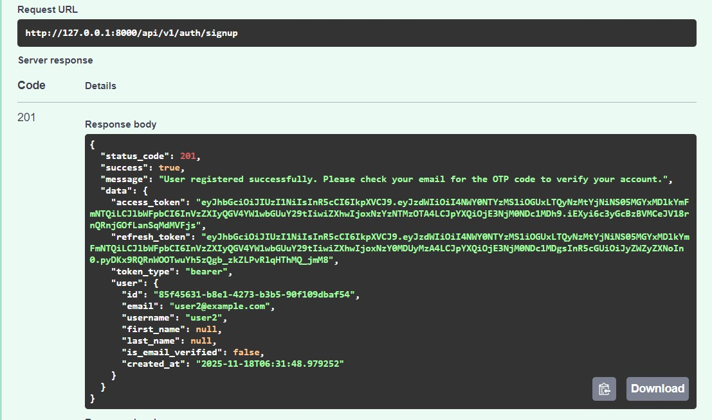
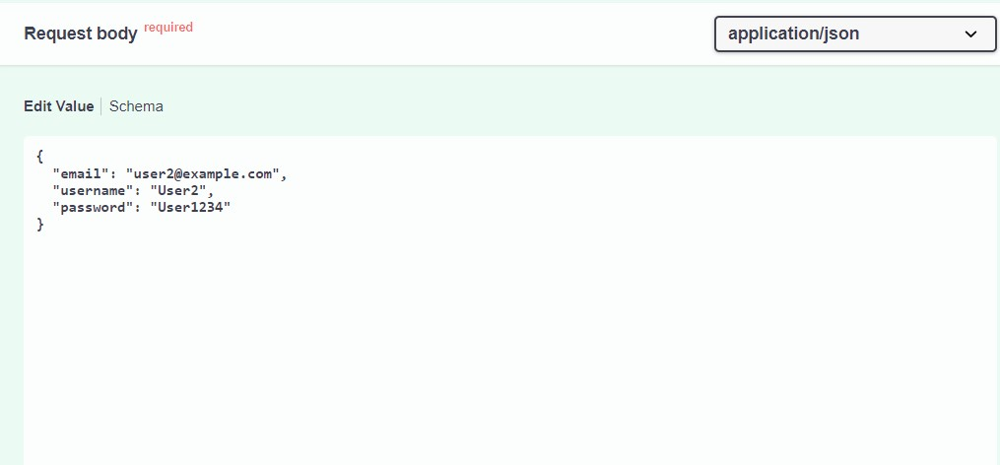

# API Responses Documentation

This document contains example responses for key API endpoints, including screenshots for reference.

## How to Add Screenshots
- Place your screenshot images in the `docs/screenshots/` directory.
- Reference them in this document using Markdown:
  
  ```markdown
  
  ```

---

## Example: Signup Endpoint

**Request:**
```
POST /api/v1/auth/signup
Content-Type: application/json
{
  "email": "user@example.com",
  "username": "user123",
  "password": "Password123"
}
```

**Success Response:**
```
Status: 201 Created
{
  "message": "User registered successfully. Please check your email for the OTP code to verify your account.",
  "data": {
    "access_token": "...",
    "refresh_token": "...",
    "token_type": "bearer",
    "user": {
      "id": "...",
      "email": "user@example.com",
      "username": "user123",
      "is_email_verified": false,
      "created_at": "..."
    }
  }
}
```

**Screenshot:**




---

_Add more endpoints and screenshots as needed._
